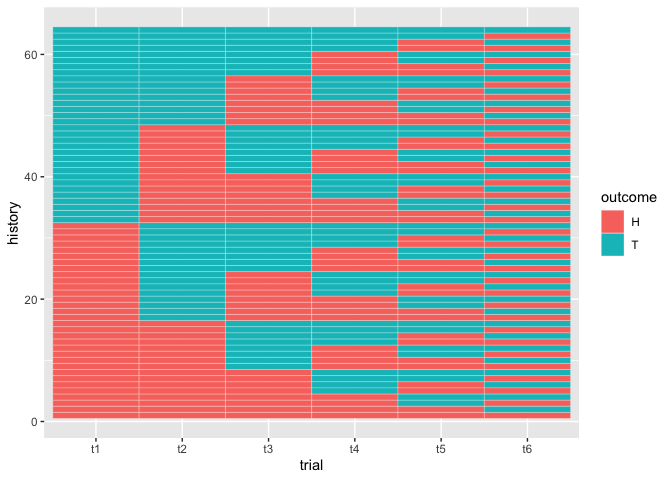
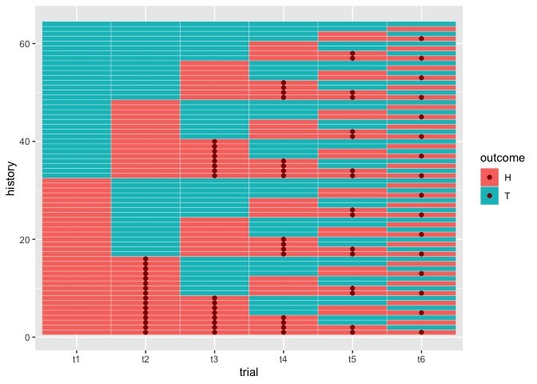
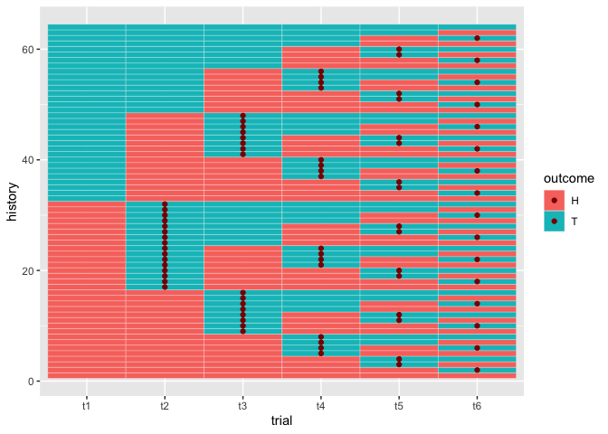
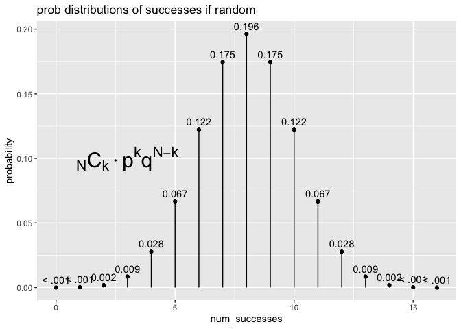

<!-- README.md is generated from README.Rmd. Please edit that file -->

# tidybernoulli

<!-- badges: start -->

<!-- badges: end -->

The goal of tidybernoulli creates a framework work with independent,
repeated trials in an intuitive, fluid, and computation-friendly way.

A Bernoulli trial is an independent trial with two outcomes (usually
success and a failure), where probabilities associated with each new
trial are independent of previous trials.

Instead of looking at the realization of single trials and trials
histories, we look at probability distributions that are generated by
adding Bernoulli trials. Data frames that are generated contain a row
for each outcome history and two columns for each trial index – one
column with the trial outcome and one column with the associated
probability.

Once all the outcome-probability pathways have been built up, summary
functions allow us to ask questions about global outcomes; e.g. how
likely are we to observe at least one success in 5 fair coin flips.
Students will be able to see distributions like the binomial
distribution emerge from first principles.

tidybernoulli was inspired by and is complementary to
[ma206distributions](https://evamaerey.github.io/ma206distributions/)
which treats common discrete probability distributions consistent with
data requirements for use in with ggplot2 and the rest of the tidyverse.

## Installation

You can install the development version of tidybernoulli from
[GitHub](https://github.com/) with:

``` r
# install.packages("devtools")
devtools::install_github("EvaMaeRey/tidybernoulli")
```

Then load the package.

``` r
library(tidybernoulli)
```

# Single trials

We provide some single Bernoulli trial functions

``` r
bernoulli_trial()
#>   outcome prob
#> 1       0 0.75
#> 2       1 0.25
weighted_coin()
#>   outcome prob
#> 1   tails 0.25
#> 2   heads 0.75
fair_coin()
#>   outcome prob
#> 1   tails  0.5
#> 2   heads  0.5
```

As well as few non-bernoulli events and probabilities

``` r
prize_wheel()
#>   outcome           prob
#> 1      $0 9 of 12 slices
#> 2      $1 2 of 12 slices
#> 3      $3  1 of 12 slice
```

# Multiple trials

This is a basic example which shows you how to solve a common problem:

``` r
## basic example code
```

``` r
bernoulli_trial()
#>   outcome prob
#> 1       0 0.75
#> 2       1 0.25

trial_init() |>
  add_trials()
#> # A tibble: 4 × 5
#>   history t1_outcome t1_prob t2_outcome t2_prob
#>     <int>      <dbl>   <dbl>      <dbl>   <dbl>
#> 1       1          0    0.75          0    0.75
#> 2       2          0    0.75          1    0.25
#> 3       3          1    0.25          0    0.75
#> 4       4          1    0.25          1    0.25

trial_init() |>
  add_trials() |>
  add_trials() 
#> # A tibble: 8 × 7
#>   history t1_outcome t1_prob t2_outcome t2_prob t3_outcome t3_prob
#>     <int>      <dbl>   <dbl>      <dbl>   <dbl>      <dbl>   <dbl>
#> 1       1          0    0.75          0    0.75          0    0.75
#> 2       2          0    0.75          0    0.75          1    0.25
#> 3       3          0    0.75          1    0.25          0    0.75
#> 4       4          0    0.75          1    0.25          1    0.25
#> 5       5          1    0.25          0    0.75          0    0.75
#> 6       6          1    0.25          0    0.75          1    0.25
#> 7       7          1    0.25          1    0.25          0    0.75
#> 8       8          1    0.25          1    0.25          1    0.25
```

# Summarizing possible outcome histories

``` r
library(magrittr)
trial_init(prob = .3) %>%
  add_trials() %>%
  add_trials() %>%
  .$out %>%
  sum_across() %>%
  prod_across()
#> # A tibble: 8 × 9
#>   global_probs global_…¹ history t1_ou…² t1_prob t2_ou…³ t2_prob t3_ou…⁴ t3_prob
#>          <dbl>     <dbl>   <int>   <dbl>   <dbl>   <dbl>   <dbl>   <dbl>   <dbl>
#> 1        0.343         0       1       0     0.7       0     0.7       0     0.7
#> 2        0.147         1       2       0     0.7       0     0.7       1     0.3
#> 3        0.147         1       3       0     0.7       1     0.3       0     0.7
#> 4        0.063         2       4       0     0.7       1     0.3       1     0.3
#> 5        0.147         1       5       1     0.3       0     0.7       0     0.7
#> 6        0.063         2       6       1     0.3       0     0.7       1     0.3
#> 7        0.063         2       7       1     0.3       1     0.3       0     0.7
#> 8        0.027         3       8       1     0.3       1     0.3       1     0.3
#> # … with abbreviated variable names ¹​global_outcome, ²​t1_outcome, ³​t2_outcome,
#> #   ⁴​t3_outcome
```

``` r
library(magrittr)
bernoulli_trial(prob = .5) %>%
  trial_init() %>% 
  add_trials() %>%
  add_trials() %>%
  add_trials(5) %>%
  .$out %>%
  sum_across() %>%
  prod_across()
#> # A tibble: 256 × 19
#>    global_probs global…¹ history t1_ou…² t1_prob t2_ou…³ t2_prob t3_ou…⁴ t3_prob
#>           <dbl>    <dbl>   <int>   <dbl>   <dbl>   <dbl>   <dbl>   <dbl>   <dbl>
#>  1      0.00391        0       1       0     0.5       0     0.5       0     0.5
#>  2      0.00391        1       2       0     0.5       0     0.5       0     0.5
#>  3      0.00391        1       3       0     0.5       0     0.5       0     0.5
#>  4      0.00391        2       4       0     0.5       0     0.5       0     0.5
#>  5      0.00391        1       5       0     0.5       0     0.5       0     0.5
#>  6      0.00391        2       6       0     0.5       0     0.5       0     0.5
#>  7      0.00391        2       7       0     0.5       0     0.5       0     0.5
#>  8      0.00391        3       8       0     0.5       0     0.5       0     0.5
#>  9      0.00391        1       9       0     0.5       0     0.5       0     0.5
#> 10      0.00391        2      10       0     0.5       0     0.5       0     0.5
#> # … with 246 more rows, 10 more variables: t4_outcome <dbl>, t4_prob <dbl>,
#> #   t5_outcome <dbl>, t5_prob <dbl>, t6_outcome <dbl>, t6_prob <dbl>,
#> #   t7_outcome <dbl>, t7_prob <dbl>, t8_outcome <dbl>, t8_prob <dbl>, and
#> #   abbreviated variable names ¹​global_outcome, ²​t1_outcome, ³​t2_outcome,
#> #   ⁴​t3_outcome
```

# Further summary based on outcome of interest…

``` r
library(dplyr)
#> 
#> Attaching package: 'dplyr'
#> The following objects are masked from 'package:stats':
#> 
#>     filter, lag
#> The following objects are masked from 'package:base':
#> 
#>     intersect, setdiff, setequal, union
bernoulli_trial(prob = .5) %>%
  add_trials() %>% 
  add_trials() %>%
  add_trials() %>%
  add_trials(3) %>%
  .$out %>%
  sum_across() %>%
  prod_across() %>%
  group_by(global_outcome) %>%
  summarize(probs = sum(global_probs))
#> # A tibble: 8 × 2
#>   global_outcome   probs
#>            <dbl>   <dbl>
#> 1              0 0.00781
#> 2              1 0.0547 
#> 3              2 0.164  
#> 4              3 0.273  
#> 5              4 0.273  
#> 6              5 0.164  
#> 7              6 0.0547 
#> 8              7 0.00781
```

# Cross-validate work

``` r
dbinom(x =  0:7, size = 7, prob = .5)
#> [1] 0.0078125 0.0546875 0.1640625 0.2734375 0.2734375 0.1640625 0.0546875
#> [8] 0.0078125
```

-----

or…

``` r
bernoulli_trial(prob = .5) |>
  add_trials() |>
  add_trials() |>
  to_tsibble()  |>
  group_by(history)  |>
  summarize(hist_prob = prod(prob),
            count_successes = sum(outcome),
            paths = paste(outcome, collapse = ",")) |>
  arrange(count_successes) |>
  group_by(count_successes) |>
  summarize(count_prob = sum(hist_prob))
#> # A tibble: 4 × 2
#>   count_successes count_prob
#>             <dbl>      <dbl>
#> 1               0      0.125
#> 2               1      0.375
#> 3               2      0.375
#> 4               3      0.125
```

-----

# drob quick job on veridical paradox

> A \#tidyverse simulation to demonstrate that if you wait for two heads
> in a row, it takes 6 flips on average, while you wait for a heads then
> a tails, it takes 4 flips on average

``` r
library(tidyverse)
#> ── Attaching core tidyverse packages ──────────────────────── tidyverse 2.0.0 ──
#> ✔ forcats   1.0.0     ✔ readr     2.1.4
#> ✔ ggplot2   3.4.1     ✔ stringr   1.5.0
#> ✔ lubridate 1.9.2     ✔ tibble    3.2.0
#> ✔ purrr     1.0.1     ✔ tidyr     1.3.0
#> ── Conflicts ────────────────────────────────────────── tidyverse_conflicts() ──
#> ✖ tidyr::extract()   masks magrittr::extract()
#> ✖ dplyr::filter()    masks stats::filter()
#> ✖ dplyr::lag()       masks stats::lag()
#> ✖ purrr::set_names() masks magrittr::set_names()
#> ℹ Use the conflicted package (<http://conflicted.r-lib.org/>) to force all conflicts to become errors

# drob
crossing(trial = 1:1000,
         flip = 1:100) %>% 
  mutate(heads = rbinom(n(), 1, .5)) %>% 
  group_by(trial) %>% 
  mutate(next_flip = lead(heads),
         hh = heads & next_flip,
         ht = heads & !next_flip) %>% 
  summarise(first_hh = which(hh)[1] + 1, 
            first_ht = which(ht)[1] + 1) %>% 
  summarise(first_hh = mean(first_hh),
            first_ht = mean(first_ht))
#> # A tibble: 1 × 2
#>   first_hh first_ht
#>      <dbl>    <dbl>
#> 1     5.90     3.93
```

It’s about the second chances…

``` r
options(pillar.print_max = Inf)
fair_coin(outcome_set = c("T", "H")) %>% 
  select(-prob) %>% 
  trial_init() %>% 
  add_trials() %>% 
  add_trials() %>% 
  add_trials() %>%
  add_trials() %>%
  add_trials() %>%
  to_tsibble() %>% 
  group_by(history) %>% 
  ggplot() + 
  aes(y = history, x = trial) + 
  geom_tile(color = "white") + 
  aes(fill = outcome) ->
baseplot; baseplot
```



``` r

baseplot + 
  geom_point(data = . %>% filter( outcome == "H" & lag(outcome) == "H"), color = "darkred") 
```



``` r

baseplot + 
  geom_point(data = . %>% filter( outcome == "T" & lag(outcome) == "H"), color = "darkred")
```



## 16 dolphin trials

``` r
bernoulli_trial(prob = .5) |>
  add_trials() |>
  add_trials() |>
  to_tsibble()  |>
  group_by(history)  |>
  summarize(hist_prob = prod(prob),
            count_successes = sum(outcome),
            paths = paste(outcome, collapse = ",")) |>
  arrange(count_successes) |>
  group_by(count_successes) |>
  summarize(prob = sum(hist_prob))
#> # A tibble: 4 × 2
#>   count_successes  prob
#>             <dbl> <dbl>
#> 1               0 0.125
#> 2               1 0.375
#> 3               2 0.375
#> 4               3 0.125

options(scipen = 10)
bernoulli_trial(prob = .5) |>
  add_trials(15) |>
  to_tsibble()  |>
  group_by(history)  |>
  summarize(hist_prob = prod(prob),
            count_successes = sum(outcome),
            paths = paste(outcome, collapse = ",")) |>
  arrange(count_successes) |>
  group_by(count_successes) |>
  summarize(prob = sum(hist_prob))
#> # A tibble: 17 × 2
#>    count_successes      prob
#>              <dbl>     <dbl>
#>  1               0 0.0000153
#>  2               1 0.000244 
#>  3               2 0.00183  
#>  4               3 0.00854  
#>  5               4 0.0278   
#>  6               5 0.0667   
#>  7               6 0.122    
#>  8               7 0.175    
#>  9               8 0.196    
#> 10               9 0.175    
#> 11              10 0.122    
#> 12              11 0.0667   
#> 13              12 0.0278   
#> 14              13 0.00854  
#> 15              14 0.00183  
#> 16              15 0.000244 
#> 17              16 0.0000153


collapse <- function(x, collapse = ", "){
  paste(x, collapse = collapse)
}

bernoulli_trial(prob = .5, outcome_set = c("nope", "fish")) |>
  add_trials(15) |>
  to_tsibble() %>% 
  group_by(history) %>% 
  summarise(history = collapse(outcome),
            sum_successes = sum(outcome == "fish"),
            prob = prod(prob)) %>% 
  group_by(sum_successes) %>% 
  summarise(prob = sum(prob))
#> # A tibble: 17 × 2
#>    sum_successes      prob
#>            <int>     <dbl>
#>  1             0 0.0000153
#>  2             1 0.000244 
#>  3             2 0.00183  
#>  4             3 0.00854  
#>  5             4 0.0278   
#>  6             5 0.0667   
#>  7             6 0.122    
#>  8             7 0.175    
#>  9             8 0.196    
#> 10             9 0.175    
#> 11            10 0.122    
#> 12            11 0.0667   
#> 13            12 0.0278   
#> 14            13 0.00854  
#> 15            14 0.00183  
#> 16            15 0.000244 
#> 17            16 0.0000153
```

## Generalizing and simplifying to binomial equation…

``` r
ma206equations::typeset_eq_binomial()
#> ${{_N}C{_k}} \cdot p^kq^{N-k}$
ma206equations::typeset_eq_choose()
#> $n!\(r!*(n-r)!)$
```


where

!)")

## Quick viz…

``` r
ma206distributions::tidy_dbinom(num_trials = 16, single_trial_prob = .5) %>% 
  ggplot() + 
  aes(x = num_successes,
      y = probability) + 
  ma206distributions::geom_lollipop(annotate = TRUE) + 
  labs(title = "prob distributions of successes if random") + 
  ma206equations::stamp_eq_binomial(x = 3, y = .1, size = 8)
```



# Peek into internals of tidybernoulli

``` r
readLines("R/bernoulli-trial.R")[150:200]
#>  [1] "                    # objects"                                                           
#>  [2] "                    trial = NULL,"                                                       
#>  [3] "                    index = NULL,"                                                       
#>  [4] "                    out = NULL,"                                                         
#>  [5] "                    out_ts = NULL,"                                                      
#>  [6] "                    as_ts = FALSE,"                                                      
#>  [7] ""                                                                                        
#>  [8] ""                                                                                        
#>  [9] "                    # functions"                                                         
#> [10] "                    init = function(trial = NULL){"                                      
#> [11] ""                                                                                        
#> [12] "                      self$trial <- trial"                                               
#> [13] "                      self$index <- 1"                                                   
#> [14] ""                                                                                        
#> [15] "                      self$out <- cross_trials(self$trial,"                              
#> [16] "                                               num_trials = self$index) |>"              
#> [17] "                        dplyr::mutate(history = dplyr::row_number()) |>"                 
#> [18] "                        dplyr::select(.data$history, dplyr::everything())"               
#> [19] ""                                                                                        
#> [20] "                      invisible(self)          #returns"                                 
#> [21] ""                                                                                        
#> [22] ""                                                                                        
#> [23] "                    },"                                                                  
#> [24] ""                                                                                        
#> [25] "                    update = function(increment = 1){ # a method"                        
#> [26] ""                                                                                        
#> [27] "                      self$index <- self$index + increment"                              
#> [28] ""                                                                                        
#> [29] "                      # displaying"                                                      
#> [30] "                      self$out <- cross_trials(self$trial, num_trials = self$index)  |>" 
#> [31] "                        dplyr::mutate(history = dplyr::row_number()) |>"                 
#> [32] "                        dplyr::select(.data$history, dplyr::everything())"               
#> [33] ""                                                                                        
#> [34] "                      invisible(self)          #returns"                                 
#> [35] ""                                                                                        
#> [36] "                    },"                                                                  
#> [37] ""                                                                                        
#> [38] "                    to_time_series = function(as_ts = FALSE){"                           
#> [39] ""                                                                                        
#> [40] "                      self$as_ts <- as_ts"                                               
#> [41] ""                                                                                        
#> [42] "                    },"                                                                  
#> [43] ""                                                                                        
#> [44] "                    print = function() {  # print method; default is to print everything"
#> [45] ""                                                                                        
#> [46] "                      if(self$as_ts){"                                                   
#> [47] ""                                                                                        
#> [48] "                            print("                                                      
#> [49] ""                                                                                        
#> [50] "                            self$out |>"                                                 
#> [51] "                              tidyr::pivot_longer ("
```
